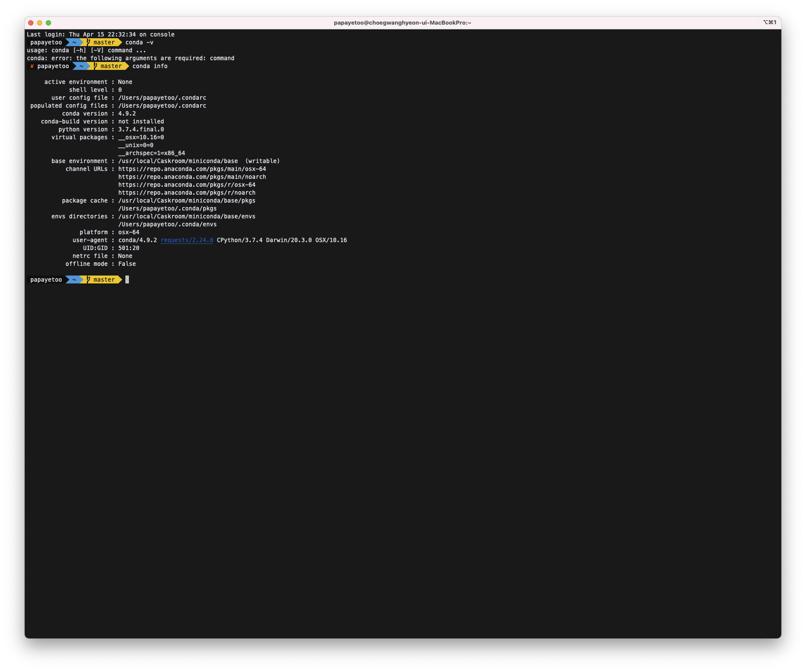
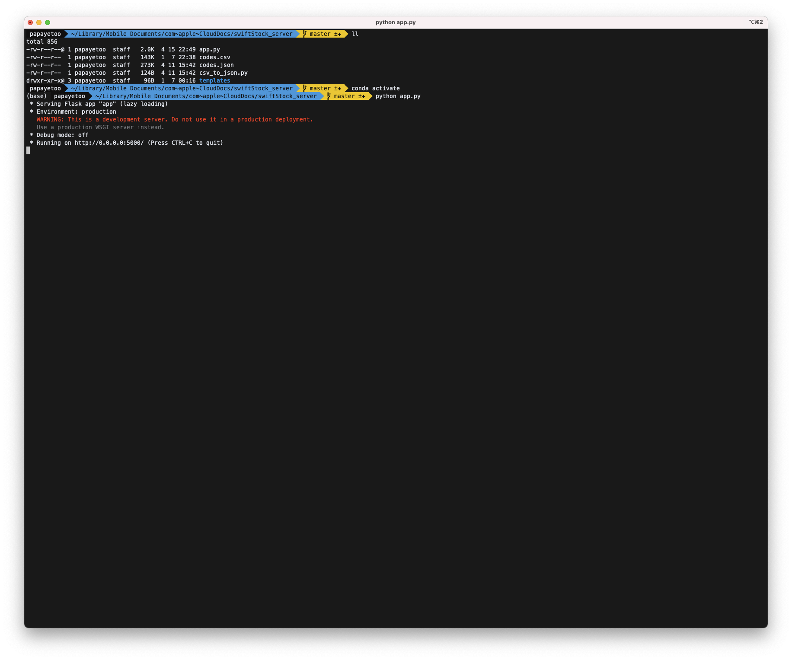
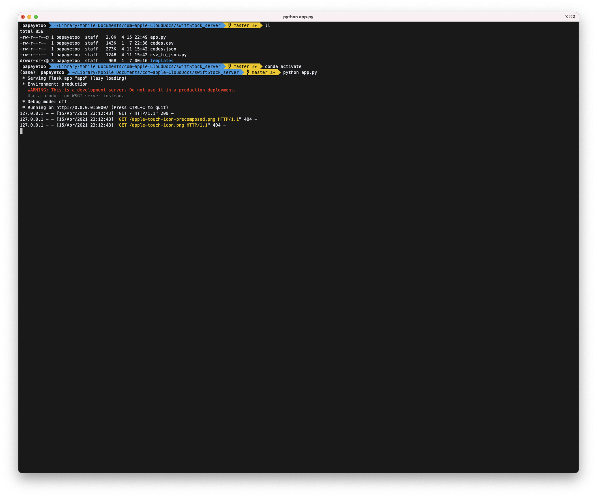
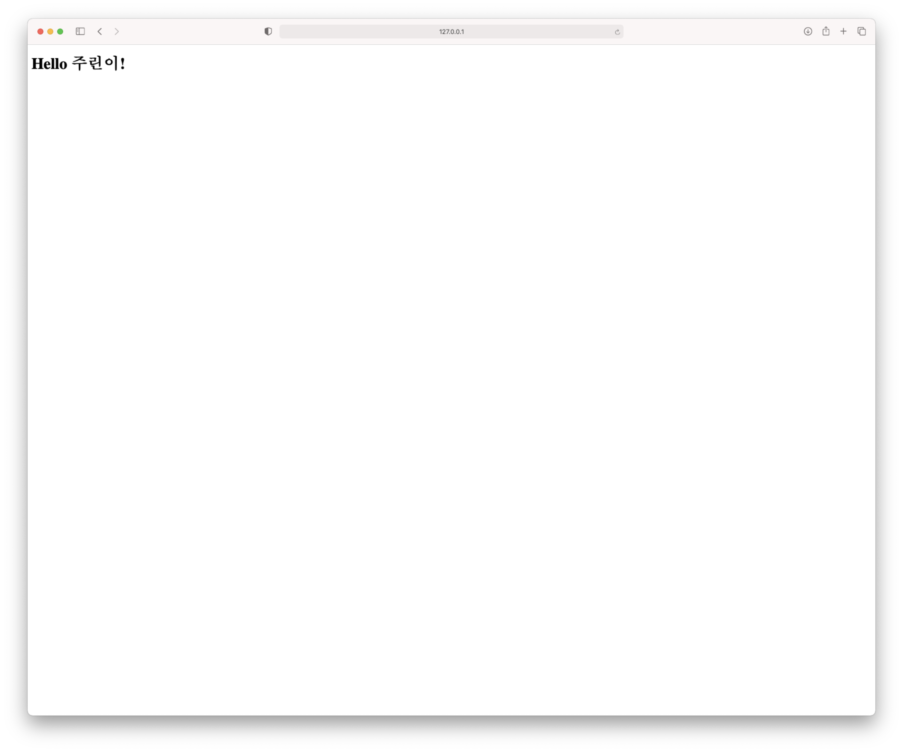

# 주식 차트 앱 중계 서버 동작
1. 주린이 앱에서 종목코드를 중계 서버로 request르 보냄
2. 중계서버에서는 받아서 받은 종목코드에 대하 주식 정보(시가, 고가, 저가, 종가, 거래량)을 response로 앱으로 보냄.

## 중계 서버 환경
1. flask : python 웹 프레임워크 중 하나인 flask 사용해 개발용 서버 환경 구성
2. pandas-datareader: 코스피 주가를 가져오기 위한 python library


## 중계 서버 구성 방법
1. miniconda을 설치한다. [miniconda 다운로드](https://docs.conda.io/en/latest/miniconda.html)
2. 터미널을 종료한 후에 다시 접속하여 minconda가 설치 되었는지 확인한다.
```shell
conda info
```

3. miniconda을 설치한 후에 아래와 같이 가상환경을 만들어 준다.
```shell
conda create -n swiftStock_server python=3.9.0
```
4. 가상환경을 실행시킨다.
```shell
conda activate swiftStock_server
```
5. swiftStock_server 가상환경에 필요한 패키지인 pandas-datareader와 flask를 설치한다.
```shell
conda install -n swiftStock_server -c conda-forget pandas-datareader flask
```
6. pandas-datareader 와 flask 설치를 확인한다.
```shell
conda list -n swiftStock_server|grep flask
conda list -n swiftStock_server|grep pandas-datareader
```
7. miniconda와 flask, pandas-datareader 설치가 확인되었다면 중계 서버를 구성할 디렉토리에서
git clone을 실행한다.
```shell
git clone https://github.com/papayetoo/swiftStock_Server.git
```
8. swiftStock_Server 디레토리로 이동해 app.py를 실행시킨다.
```shell
python app.py
```

9. 8의 스크린샷과 같은 내용이 보이는 데 0.0.0.0은 현재 ip(127.0.0.1로도 접속 가능)를 의미하며, 현재 ip는 아래 커맨드를 실행해 확인할 수 있다.웹 브라우져를 실행시켜 현재 ip와 5000번 포트에 접속해 보자.
```shell
ifconfig|grep inet
```
10. 아래 스크린샷 2개와 같은 화면을 확인할 수 있다면 서버 구성은 끝났다. 이제는 주식 차트 앱을 실행 시킨다면 서버 콘솔창에서 종가 데이터를 전달하는 메시지를 확인할 수 있다.


